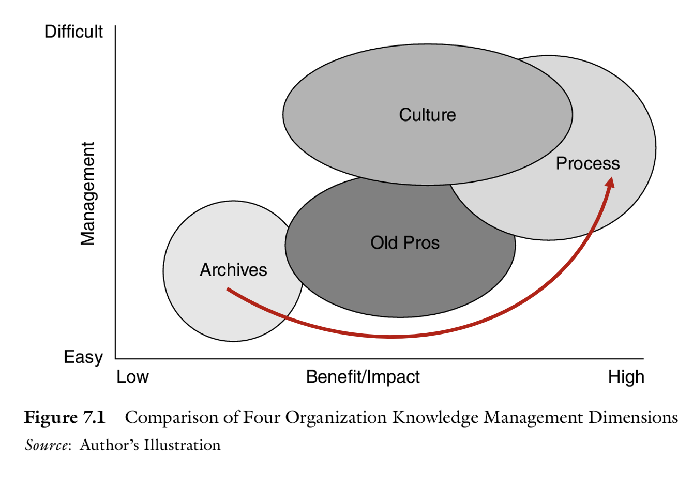
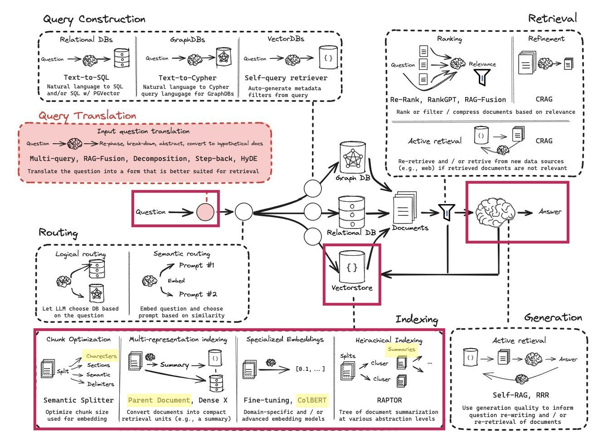

Overview
========

Purpose
-------
There is an overwhelming amount of information available to aerospace engineers. This information is often scattered across many different sources, and it can be difficult to find the information you need. The difficulty usually comes in the form of proprietary information or unstructured data. Normally, this is in report form which is already in or can be put into a PDF format. Furthermore, older information from NASA, SMC, or the Air Force will come in this form and is not well indexed for new space companies. 

There is also a huge amount of research and development being done for the AI industry which has huge implications to how access to this information be improved.

aerospace_chatbot intents to provide a practical better way of accessing this type of information that comes in PDF formats. It is merely a shortcut using open source AI tools and applied to the aerospace industry.

For visual learners, this app is meant to do the following (`reference <https://www.amazon.com/Organizational-Learning-Companies-Institutions-Knowledge/dp/1137301546>`__):

How it works (backend)
----------------------
The backend refers to the modules which are used to process and return data. They generally are not user facing.

A visual overview of how this code works is below. The parts of this which are utilized in this code are highlighted.

Of note, there are many areas of this workflow which have not been explored practically but have a lot of potential. The areas which are implemented, which are of interest and highlighted are:

- **Chunk optimization**: currently this is in the form of a fixed number of words per chunk. Refer to :doc:`../modules/data_processing` for more information.
- **Multi-representation indexing**: it is possible to index with the document chunks and generate summaries for each chunk which are used when providing answers. Refer to :doc:`../modules/data_processing` for more information.
- **Specialized embeddings**: Instead of using a vector database, it is possible to create a context optimized retrieval model with ColBERT. This is performed using `RAGatouille <https://github.com/hwchase17/RAGatouille/tree/main>`__. Refer to :doc:`../modules/data_processing` for more information.
- **Heirarchical indexing**: It is possible to upload small document chunks, which are compared to user queries, then return the parent document chunk when providing the response to the use. Refer to :doc:`../modules/data_processing` for more information.

A very practical overview of how this works is also `here <https://towardsdatascience.com/retrieval-augmented-generation-rag-from-theory-to-langchain-implementation-4e9bd5f6a4f2>`__.

Sequence of operations
^^^^^^^^^^^^^^^^^^^^^^

1. PDF files uploaded to repository
"""""""""""""""""""""""""""""""""""
In the `/data` folder, PDF files are uploaded.

2. PDF files are converted to text and "chunked"
""""""""""""""""""""""""""""""""""""""""""""""""
PDf files are read page-by-page and the text is extracted. Currently, no table or images are pulled, but this could be done in the future.

3. Chunks are converted to embeddings
"""""""""""""""""""""""""""""""""""""
Embeddings are multi-dimensional vectors which capture the meaning of the text. These are generated using a pre-trained model. Models which are used are captured in the config file. Refer to :doc:`configs` for more information.

4. Chunks are uploaded to a database
""""""""""""""""""""""""""""""""""""
Document chunks are uploaded to a database as embeddings.

The primary two methods for storing embeddings:
- ChromaDB: this is a locally defined database. It is free but not web-based.
- Pinecone: this is a web-based database. It is not free but web based.

**Advanced functionality**

- Parent-child: a local database is created which matches "Parent" chunks to "Child" chunks. The "Child" chunks are references when the user query is made, but the "Parent" chunk is returned to the LLM when formulating a response.
- Summaries: similar to Parent-Child, except a summary of the chunk is created using an LLM and stored on a local database.
- RAGatouille: refer to `RAGatouille <https://github.com/hwchase17/RAGatouille/tree/main>`__ for more information. This is a specialized retrieval model which is optimized for the information you are trying to retrieve.

5. User query is converted to an embedding
""""""""""""""""""""""""""""""""""""""""""
Identical to step 3, except for the user input.

6. User query is compared to database
"""""""""""""""""""""""""""""""""""""
The user query is compared to the database of embeddings and a relevancy search is performed to return the most relevant information.

When this information is returned, the source information from the PDF is also returned so the user can access the original document.

**Advanced functionality**

If Parent-Child or Summary RAG types are used, the Parent Chunk, or Summary of the most relevant chunk found in the database.

7. Response is generated using an LLM
"""""""""""""""""""""""""""""""""""""
The response is generated using an LLM. The response is generated using the context retrieved and the LLM you specify. There are prompts used to generate the response, which are discussed in the :doc:`../modules/prompts` section. The choice of prompt is important because it will minimize hallucination of the LLM and also only return the most relevant information.

The prompt which is used to return the response at the end of this process is located here in LangSmith `dmueller/ams-chatbot-qa-retrieval <https://smith.langchain.com/hub/dmueller/ams-chatbot-qa-retrieval?organizationId=45eb8917-7353-4296-978d-bb461fc45c65>`__.

The response is then returned to the user.

Secret Keys
^^^^^^^^^^^

Secret keys are set when the streamlit Home.py page is fully loaded. The secret keys are committed to environment variables. You can see the secret keys used on the homepage under the "Connection Status" expander. On each stremalit page, these secret keys are also accessible via the secrets variable output via ``admin.st_setup_page``.

The exception is for LOCAL_DB_PATH, which is set only as an environment variable. This is for portability reasons to Docker and other deployments.

How it works (frontend)
-----------------------
The frontend is what the user interfaces with. `Streamlit <https://streamlit.io/>`__ is used to create the frontend.

Refer to :doc:`streamlit_apps`.