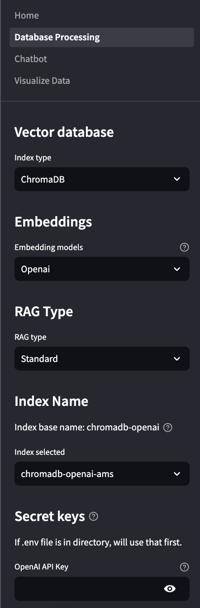
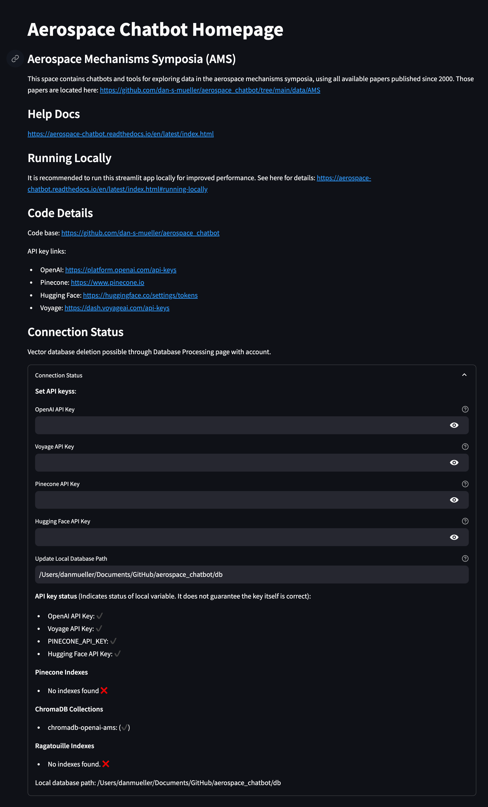
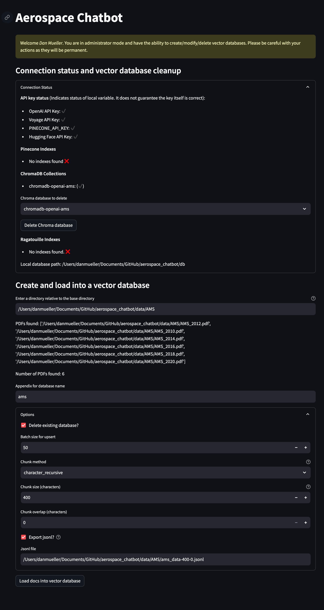
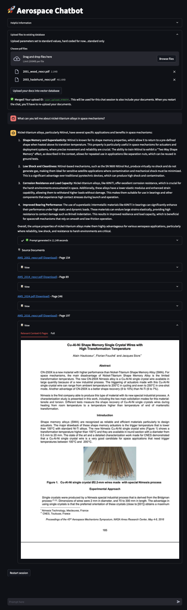

Streamlit Apps
==============

Structure
---------
The Streamlit app is initialized from ``app.py``. The sidebar lists other apps which are used to manage databases, chat with PDF data, and visualize the PDF data. Each of the apps, are described below. The available models and functionality is set by the `AEROSPACE_CHATBOT_CONFIG` environment variable.

Sidebar
^^^^^^^
In each app there is a sidebar which is used to apply settings. The sidebar is dynamic and will only show the settings that are relevant to the app. Each selectable item has a hover over help button describing what the item does.

Options which require further explination are described below. LLM options and types have hyperlinks in the help button in each app.

- RAG Type: Choose between Standard, `Parent-Child <https://python.langchain.com/docs/modules/data_connection/retrievers/parent_document_retriever/>`_, and `Summary <https://python.langchain.com/docs/modules/data_connection/retrievers/multi_vector/#summary>`__. Refer to these links to read about how these retrievers work.
- Index Selected: When querying the database, this will select the index you interact with. It is useful when you have multiple indexes of different types.

Home
^^^^
The home page has reference information as well as an overview of the keys and databases. You set keys on the home page for use in the other apps. It is also possible to do this in the sidebar when using other apps.

Database Processing
^^^^^^^^^^^^^^^^^^^
This app is restricted to users who have access. Access is controlled and described in the :doc:`configs` section.

This app is used to manage databases. You can add, delete, and update databases. There are options available to export intermediate files for debugging or further processing.

Deleting existing databases is available via the connection status dropdown.

Chatbot
^^^^^^^^
This is the main app which is used for querying and asking questions about the data uploaded from PDFs. Functionality here includes: memory of the previous prompt/queries, alternate questions based on the prompt and response, and source documents. These are available under the dropdown below the last response.

To restart a conversation, click the "Restart session" button twice.

When a query is made, the responses are stored in a separate vector database. This database is used for visualization in the Visualize Data app, which can be used to explore.

Visualize Data
^^^^^^^^^^^^^^
This app allows visualization using `Spotlight from Renumics <https://renumics.com/open-source/spotlight/>`__. A new browser will open with the visualization. The data is loaded from the database and the settings are applied from the sidebar.

.. note::
  Note that this functionality is only available for locally deployed applications for now. For a static version of this functionality, refer to this Hugging Face space: `Aerospace Chatbot AMS, Visualize <https://huggingface.co/spaces/ai-aerospace/aerospace_chatbot_visualize>`__. This space allows users to visualize 400 character chunks of aerospace mechanism symposia papers from the years 2000-2020.

Deployments
-----------
Local
^^^^^
It is recommended for users to deploy locally if you want to test the app with your own data. The Hugging Face deployment is set up with a preconfigured database using Aerospace Mechanism Symposia data.

To deploy Aerospace Chatbot locally, run steramlit with the following commands:

.. code-block:: bash

    poetry config virtualenvs.in-project true
    poetry install
    source .venv/bin/activate
    cd ./app
    streamlit run Home.py

.. note::
  The data visualization functionality will only work with local deployments for now.

Hugging Face Spaces
^^^^^^^^^^^^^^^^^^^
`Hugging Face <https://huggingface.co/>`__ is an open source platform for deploying machine learning models. The Aerospace Chatbot is deployed on Hugging Face using `Spaces <https://huggingface.co/spaces>`__. Spaces are apps which containerize machine learning models and LLMs. 

Aerospace Chatbot is deployed on Hugging Face spaces with pre-loaded Aerospace Mechanisms Symposia papers. By default, the papers which can be queried are those which are committed to the Aerospace Chatbot repository here: `data/AMS <https://github.com/dan-s-mueller/aerospace_chatbot/tree/main/data/AMS>`__.

This app is available at `Aerospace Chatbot <https://huggingface.co/llm/rag-chatbot>`__.